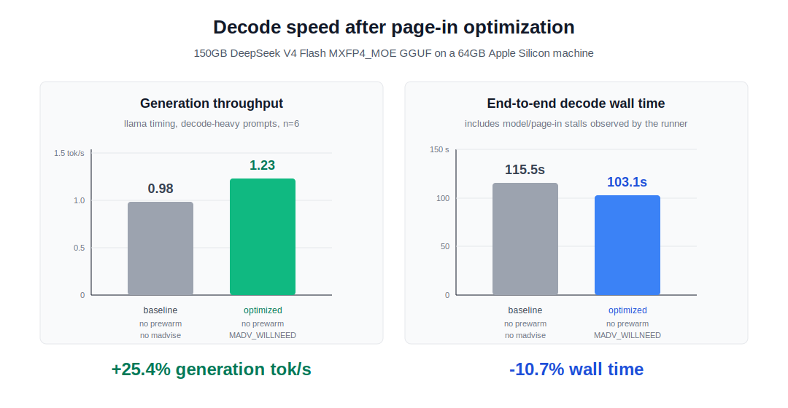

# MoE-MADV: Running a 284B MoE Model on a 64GB M1 Max

DeepSeek V4 Flash is a 284B-parameter MoE model. This repo documents a local
inference experiment that runs the 150 GB `MXFP4_MOE` GGUF file on a 64GB Apple
Silicon machine by optimizing mmap-backed expert paging with `MADV_WILLNEED`.

[한국어 README](README.ko.md)



## Headline Result

The main result is decode generation speed:

| mode | prewarm | expert page hint | decode generation | wall time |
| --- | ---: | --- | ---: | ---: |
| baseline | off | off | 0.98 tok/s | 115.5s |
| optimized | off | `MADV_WILLNEED` | 1.23 tok/s | 103.1s |

That is a **+25.4% decode generation throughput gain** and a **10.7% reduction
in end-to-end decode wall time**, without changing the model.

## Thesis

DeepSeek V4 Flash is not just a larger dense model. Its sparse MoE routing
changes the local inference bottleneck. On a machine where the 150 GB model file
is larger than RAM, the hard part is not only matrix multiplication:

> Can the OS make the right expert pages resident before decode needs them?

Dense models repeatedly reuse the same mapped weights. DeepSeek V4 Flash chooses
different expert matrices as routing changes across prompts and generated
tokens, so decode latency can be dominated by mmap page faults and NVMe-backed
page-in.

## What Changed

The optimization is intentionally small:

1. Keep the 150 GB GGUF model mmap-backed.
2. Disable CPU repacking so the model is not copied into a second in-memory
   representation.
3. Avoid mandatory static prewarm in steady state.
4. After MoE routing chooses the active experts, call `MADV_WILLNEED` on the
   selected expert matrix ranges before worker threads enter the dot-product
   loop.

No custom heap expert cache is added. macOS still owns the file-backed page
cache, so pages remain reclaimable.

## Key Findings

- The first traced profile was **97.6% I/O-active** by the page-in/disk-read
  proxy.
- Prefill and decode were both I/O-bound, but differently:
  - prefill looked like broad layer-level page-in throughput;
  - decode looked like latency from changing token-by-token expert sets.
- Decode touched roughly **3.08 GiB** of expert byte ranges per round in the
  traced run.
- Adjacent decode expert-set overlap was low: **Jaccard 0.22**.
- Static top-16 expert prewarm helped as a cold-start prior, but did not win in
  the steady-state 5-hour run.
- `MADV_WILLNEED` was the clearest measured win.

## Reports and Data

- Main report: [docs/deepseek-q4-performance-matrix.md](docs/deepseek-q4-performance-matrix.md)
- Model sources and parser artifacts: [docs/model-sources-and-parsers.md](docs/model-sources-and-parsers.md)
- Rebuild `packed_experts_q4`: [docs/packed-experts-q4.md](docs/packed-experts-q4.md)
- Applying this on larger-memory machines: [docs/appendix-other-machines.md](docs/appendix-other-machines.md)
- 5-hour benchmark summary: [docs/results/deepseek_q4_longrun_5h/README.md](docs/results/deepseek_q4_longrun_5h/README.md)
- 5-hour aggregate CSV: [docs/results/deepseek_q4_longrun_5h/summary.csv](docs/results/deepseek_q4_longrun_5h/summary.csv)
- Decode baseline addendum: [docs/results/deepseek_q4_decode_baseline/summary.md](docs/results/deepseek_q4_decode_baseline/summary.md)
- Local llama.cpp patch: [patches/deepseek-v4-flash-llama-local-q4.diff](patches/deepseek-v4-flash-llama-local-q4.diff)

The appendix in the main report includes failed attempts and dead ends:
model-path choices, CPU repack failures, static prewarm limits, pread merge
experiments, trace instrumentation issues, and postponed predictor/prefetch
ideas.

## Reproduce the Measurements

The model files are not included in this repository.

The headline benchmark uses
[`lovedheart/DeepSeek-V4-Flash-GGUF`](https://huggingface.co/lovedheart/DeepSeek-V4-Flash-GGUF),
file `DeepSeek-V4-Flash-MXFP4_MOE.gguf`, based on
[`deepseek-ai/DeepSeek-V4-Flash`](https://huggingface.co/deepseek-ai/DeepSeek-V4-Flash).
Local file size is `150,225,324,672` bytes (`139.91 GiB`).
Exact file URL:
`https://huggingface.co/lovedheart/DeepSeek-V4-Flash-GGUF/blob/cd42deba41ac0536e68b125dfc367197b0ec3038/DeepSeek-V4-Flash-MXFP4_MOE.gguf`.

The custom `packed_experts_q4` export is also not committed because the generated
binary is `137.06 GiB`. The generator and exact rebuild process are included in
[docs/packed-experts-q4.md](docs/packed-experts-q4.md).

```bash
# Build patched llama.cpp runtime
scripts/setup_deepseek_gguf_runtime.sh

# Run a quick Q4 smoke test
PROMPT='Return JSON only: {"status":"ok"}' TOKENS=8 \
  scripts/run_deepseek_q4_gguf_demo.sh

# Re-run the decode baseline comparison
scripts/run_deepseek_q4_perf_matrix.py \
  --mode infer \
  --infer-cases no_prewarm_madvise_off,no_prewarm_madvise_on \
  --prompts decode_json_seed,decode_plain_seed \
  --tokens 24 \
  --context 1024 \
  --repeats 3

# Re-run the 5-hour data collection
scripts/start_deepseek_q4_longrun_5h.sh
```

## Hardware

- Machine: Apple M1 Max
- Memory: 64GB unified memory
- OS: macOS / Darwin
- Model: DeepSeek V4 Flash `MXFP4_MOE` GGUF, 150 GB on Hugging Face
  (`139.91 GiB` locally)

## Naming

`MoE-MADV` is short for **Mixture-of-Experts + MADV_WILLNEED**. The project is
about making local MoE inference less about raw compute and more about getting
the right expert pages resident at the right time.

## Original flash-moe Context

This work started from `danveloper/flash-moe`. The original flash-moe README and
engineering context are preserved in [CLAUDE.md](CLAUDE.md). This repo focuses
on the DeepSeek V4 Flash Q4 / GGUF / `MADV_WILLNEED` experiment.

## Built With Agent Work Mem

This project was developed with
[agent-work-mem](https://github.com/daystar7777/agent-work-mem), a lightweight
shared memory protocol for long-running AI coding work.

It mattered here because the experiment was not a single prompt. It involved
model downloads, failed runtime paths, local patches, benchmark runs, resumed
sessions, and a 5-hour data collection pass. `agent-work-mem` kept the working
state explicit: what had been tried, what failed, which model files were safe to
ignore, and which benchmark results were trustworthy enough to publish.

For projects where multiple AI sessions need to continue the same technical
thread without losing context, `agent-work-mem` is a small tool with a very
practical payoff.
