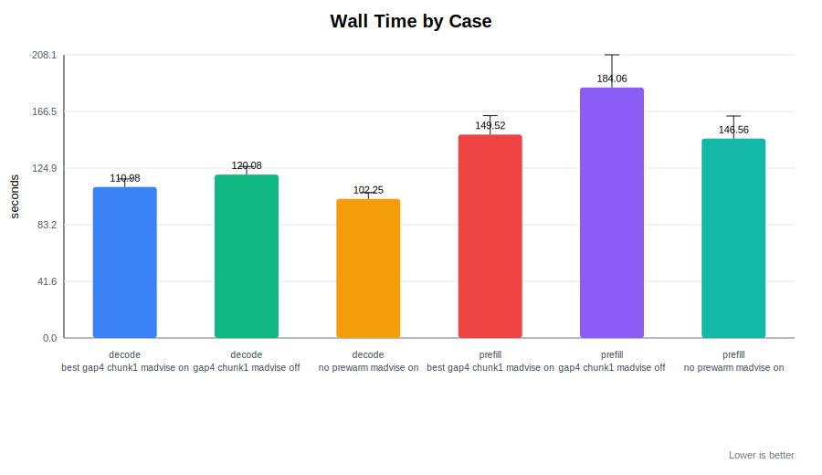
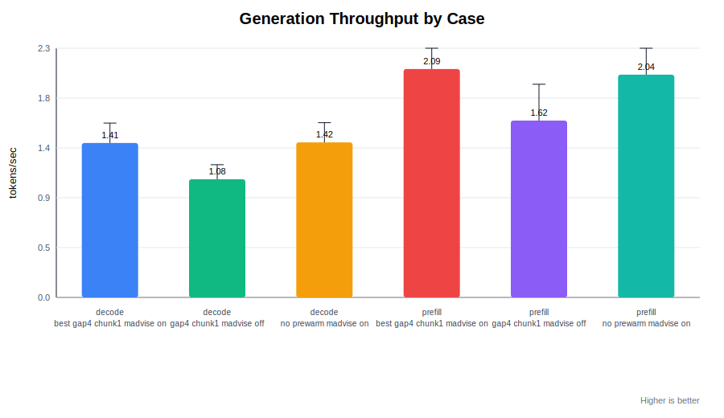
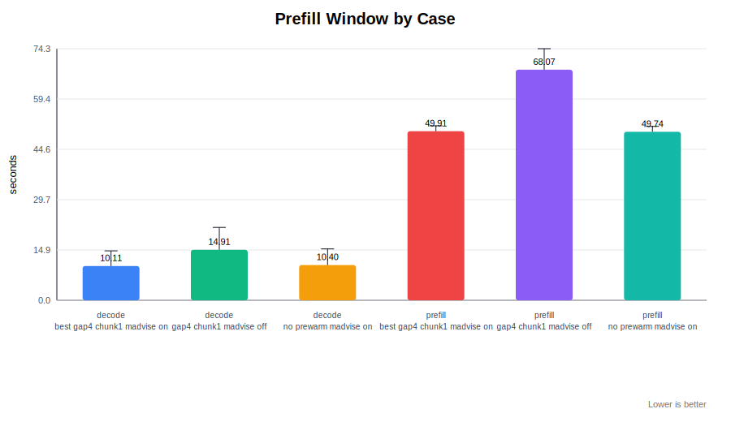
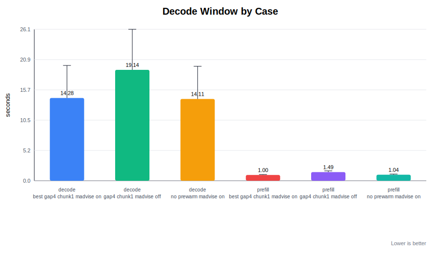
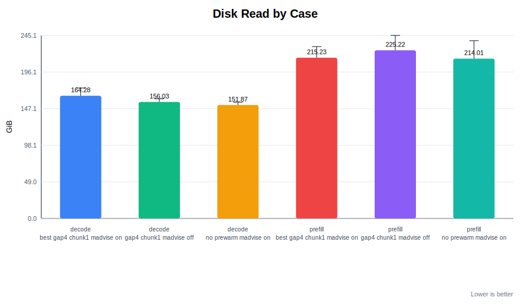

# DeepSeek V4 Flash Q4 Long-Run Dataset

Generated: 2026-05-02T14:36:51
Runs: 99

## Aggregate Summary

| suite | case | n | wall s | disk GiB | prompt t/s | gen t/s | prefill s | decode s | prefill I/O | decode I/O |
| --- | --- | ---: | ---: | ---: | ---: | ---: | ---: | ---: | ---: | ---: |
| decode | best_gap4_chunk1_madvise_on | 16 | 110.98 | 164.28 | 1.14 | 1.41 | 10.11 | 14.28 | 100.0% | 96.2% |
| decode | gap4_chunk1_madvise_off | 16 | 120.08 | 156.03 | 0.77 | 1.08 | 14.91 | 19.14 | 100.0% | 96.9% |
| decode | no_prewarm_madvise_on | 16 | 102.25 | 151.87 | 1.12 | 1.42 | 10.40 | 14.11 | 100.0% | 96.4% |
| prefill | best_gap4_chunk1_madvise_on | 18 | 149.52 | 215.23 | 1.74 | 2.09 | 49.91 | 1.00 | 100.0% | 80.5% |
| prefill | gap4_chunk1_madvise_off | 17 | 184.06 | 225.22 | 1.24 | 1.62 | 68.07 | 1.49 | 100.0% | 83.3% |
| prefill | no_prewarm_madvise_on | 16 | 146.56 | 214.01 | 1.74 | 2.04 | 49.74 | 1.04 | 100.0% | 80.3% |

## Charts

## Files

- `runs.jsonl`: raw per-run rows
- `runs.csv`: raw per-run rows for spreadsheets
- `summary.csv`: grouped aggregate data